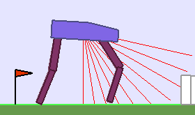
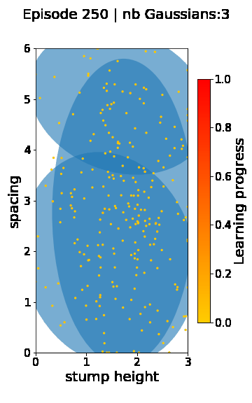
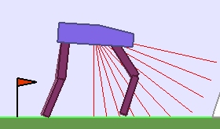
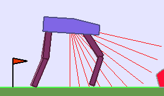

Teacher algorithms for curriculum learning of Deep RL in continuously parameterized environments
==================================

TODO add paper link and how to cite citation 

##### Table of Contents  
**[Installation](#installation)**<br>
**[Launch experiments](#launch-experiments)**<br>
**[Visualizations](#visualizations)**<br>

# Installation

1- Get the repository
```
git clone https://github.com/flowersteam/teachDeepRL
cd teachDeepRL/
```
2- Install it, using Conda for example (use Python >= 3.6)
```
conda create --name teachDRL python=3.6
conda activate teachDRL
pip install -e .
```

# Launching experiments

## Testing teachers on toy env

Test Random, RIAC, ALP-GMM and CovarGMM teachers on a simple toy env
```
cd teachDeepRL/
python3 toy_env/toy_env.py
```

## Testing teachers paired with Soft-Actor Critic on Parameterized Bi


# Visualizations

## Abstract

We consider here the problem of how a teacher algorithm can enable an unknown Deep Reinforcement Learning (RL) student 
to become good at a skill over a wide diversity of environments. To do so, we study how teacher algorithms can automate 
a learning curriculum, whereby it sequentially samples parameters for stochastic procedural generation of environments. 
Because the teacher does not initially know the capacities of its student, a key challenge for the teacher is to discover
 which environments are easy, difficult or unlearnable, and in what order to propose them to maximize the efficiency of 
 learning over the learnable ones. To achieve this, we leverage a general approach in which this problem is transformed 
 into a surrogate bandit problem where the teacher aims at sampling environments in order to maximize absolute learning 
 progress. We study several algorithms that implement this approach, applying them for the first time to Deep RL, including 
 a new algorithm mapping learning progress with Gaussian mixture models (ALP-GMM). Using parameterized variants of the 
 BipedalWalker environment, we study their efficiency to personalize a learning curriculum for learners of different 
 capacities (due to different bodies), their robustness to the ratio of learnable/unlearnable environments, and their 
 scalability to higher-dimensional non-linear parameter spaces.


# Additional Visualizations


## Stump Tracks
We tested the ALP-GMM teacher when paired with 3 different walker morphologies. For each of these walkers we show the
learned walking gates after being trained on a curriculum generated by ALP-GMM. A single run of ALP-GMM allows to train
 Soft Actor-Critic controllers to master a wide range of track distributions.
 
####  ALP-GMM + short agent &nbsp; |ALP-GMM + default agent| ALP-GMM + quad. walker

<p>

</p>

<p>

</p>

<p>

</p>

<p>

</p>

The following videos show the evolution of parameter sampling by ALP-GMM for short, default, and quadrupedal walkers.
Learning curricula generated by ALP-GMM are tailored to the capacities of each student it is paired with.

####  ALP-GMM + short agent &nbsp; |ALP-GMM + default agent| ALP-GMM + quad. walker
<p>

</p>


## Hexagon Tracks
To assess whether ALP-GMM is able to scale to parameter spaces of higher dimensionality, containing irrelevant
 dimensions, and whose difficulty gradients are non-linear, we performed experiments with quadrupedal walkers on Hexagon Tracks,
  our 12-dimensional parametric Bipedal Walker environment. The following videos shows walking gates learned in a single ALP-GMM run.


</p>

<p>

</p>